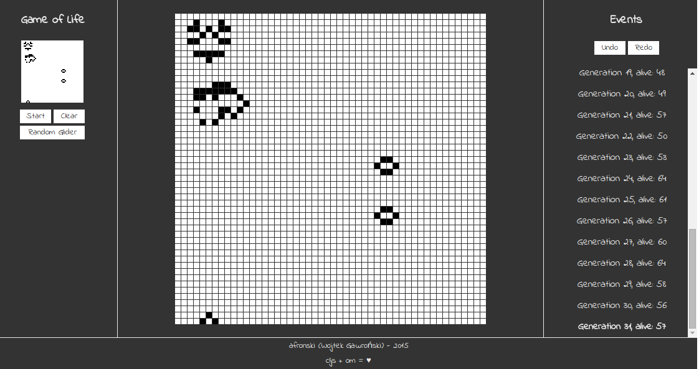

# om-my-game-of-life

## Motivation

I always wanted to do something with use of *Om* and *ClojureScript*, and here it is. With high probability it is not an idiomatic Clojure code, you have been warned. :wink:



`cljs + om = ♥`

It is a part of lecture for Meet.js meetup in Katowice (performed at 11.02.2015). You can find slides [here](http://afronski.pl/presentations/).

## How to start?

First, you need to compile the *ClojureScript* to *JS* with:

```bash
$ lein cljsbuild auto
```

Option `auto` means that it will automatically recompile when any script will change. Then you can open file from `resources/index.html` in your browser of choice.

## Improvements

- Blocking ability to add new cells when undo is active.
- Adding new cells should add events when you already have history.
- Performance.
